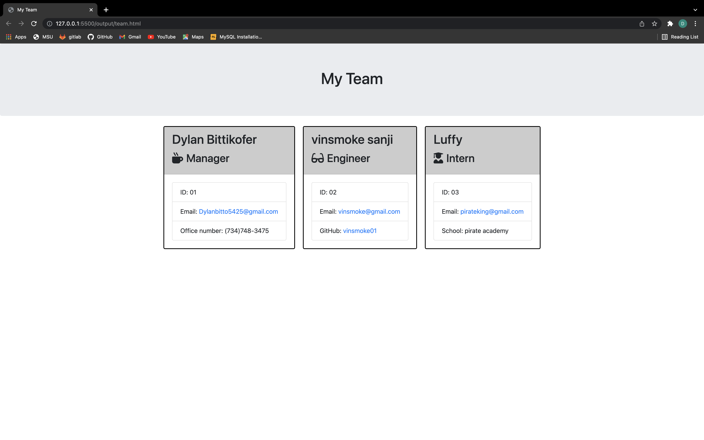

  # Profile Generator by Dylan Bittikofer
  ## Table of Contents
  * [Project Description](#project-description)
  * [Installation](#installation)
  * [Usage](#usage)
  * [License](#license)
  * [Contributing](#contributing)
  * [Demo Video](#Project-Demo-Video)
  * [Questions?](#questions)
  ## Project Description
  This project will ask you various questions once finished it will generate a team profile page
  ## Installation
  In the terminal type “npm init -y” to initialized then “npm i inquirer” to install the required “Inquirer package”
  ## Usage
  type npm test once you pass all tests type node app.js
  ## License
  This project is under MIT for licensing.
  
  ## Contributing
  Please feel free to submit code updates
  ## Project Demo Video
  https://drive.google.com/file/d/19X3EhUEM08tV_k8lX71qCpYjIVlmkP9h/view

  
  
  ## Questions
  please feel free to ask me any questions.
  Github username: Dylanbitto
  Github Email: <dylanbitto5425@gmail.com>
  